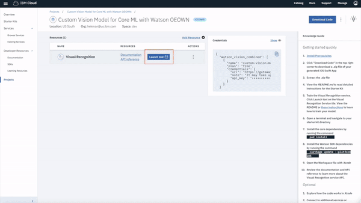

## Core ML Vision Starter Kit
IBM Cloud Mobile Starter for Core ML and Visual Recognition in Swift.

[](https://cloud.ibm.com)
[](https://developer.apple.com/swift/)

### Table of Contents
* [Summary](#summary)
* [Requirements](#requirements)
* [Configuration](#configuration)
* [Run](#run)
* [License](#license)

### Summary
This IBM Cloud Mobile Starter will showcase Core ML and the Watson Visual Recognition service. This starter kit uses Core ML to classify images offline using models trained by the Watson Visual Recognition service.

### Requirements
* iOS 12.0+
* Xcode 10+
* Swift 4.2+

### Configuration
* [Visual Recognition Model Training](#visual-recognition-model-training)
* [IBM Cloud Mobile Services Dependency Management](#ibm-cloud-mobile-services-dependency-management)
* [Watson Dependency Management](#watson-dependency-management)
* [Watson Credential Management](#watson-credential-management)

#### Visual Recognition Model Training

This application comes with support for a "Connectors" training data set. If the Connectors Visual Recognition model does not exist, the first model found remotely or any one that exists locally will be used. The gif and accompanying instruction below show you how to link your service to the Watson Studio and train your model. We also provide a gif in an mp4 format in the Resources folder if needed.



#### Setup the service from your Core ML App dashboard
1. Launch the Visual Recognition Tool from your Starter Kit's dashboard by selecting **Launch Tool**.
2. Begin creating your model by selecting **Create Model**.
2. If a project is not yet associated with the Visual Recognition instance you created, a project will be created. Otherwise, skip to [Create Model](#create-model).
3. Name your project and click Create.
    - Tip: If no storage is defined, click refresh.

##### Create Model
1. From the model creation tool, modify the classifier name to be `Connectors`. By default, the application tries to use this classifier name. If it does not exist it will use the first available. If you would like to use a specific model, make sure to modify the `defaultClassifierID` field in main [View Controller](./{APP_Name}/ViewController.swift).

2. From the sidebar, upload `hdmi_male.zip` and `usb_male.zip` by dragging and dropping their example data sets found in `./Data/Training` folder into separate class folders. Then, select each dataset and add them to your model from the drop-down menu. Feel free to add more classes using your own image sets to enhance the classifier!


3. Select `Train Model` in the upper-right corner then simply wait for the model to be fully trained and you'll be good to go!

#### IBM Cloud Mobile services Dependency Management
The IBM Cloud Mobile and [Watson SDK](https://github.com/watson-developer-cloud/swift-sdk) frameworks use [CocoaPods](https://cocoapods.org/) to manage and configure dependencies.

You can install CocoaPods using the following command:

```bash
$ sudo gem install cocoapods
```

If the CocoaPods repository is not configured, run the following command:

```bash
$ pod setup
```

For this starter, a pre-configured `Podfile` has been included in your project. To download and install the required dependencies, run the following command in your project directory:

```bash
$ pod install
```
Now Open the Xcode workspace: `{APP_Name}.xcworkspace`. From now on, open the `.xcworkspace` file because it contains all the dependencies and configurations.

If you run into any issues during the pod install, it is recommended to run a pod update by using the following commands:

```bash
$ pod update
$ pod install
```

> [View configuration](#configuration)

#### Watson Credential Management
Once the dependencies have been built and configured for the IBM Cloud Mobile service SDKs as well as the Watson Developer Cloud SDK, no more actions are needed! The unique credentials to your Watson Visual Recognition service have been injected into the application during generation.

> [View configuration](#configuration)

### Run
You can now run the application on a simulator or physical device:


The application enables you to perform Visual Recognition on images from your Photo Library or from an image you take using your device's camera (physical device only).

When you run the app, the SDK makes sure that the version of the Visual Recognition model on your device is in sync with the latest version on IBM Cloud. If the local version is older, the SDK downloads the model to your device. With a local model, you can classify images offline.

After your Core ML model has been created, you can select an image to have analyzed using the Core ML framework. Take a photo using your device's camera or choose a photo from your library using the toolbar buttons on the bottom of the application. The analysis will output a set of tags and their respective score indicating Watson's confidence.

Check out the [Core ML capabilities](https://watson-developer-cloud.github.io/swift-sdk/services/VisualRecognitionV3/index.html) of the [Watson SDK](https://github.com/watson-developer-cloud/swift-sdk) or learn more about Swift development on IBM Cloud with the [Swift Programming Guide](https://cloud.ibm.com/docs/swift/machine_learning/coreml.html#overview).

### License
This package contains code licensed under the Apache License, Version 2.0 (the "License"). You may obtain a copy of the License at http://www.apache.org/licenses/LICENSE-2.0 and may also view the License in the LICENSE file within this package.
